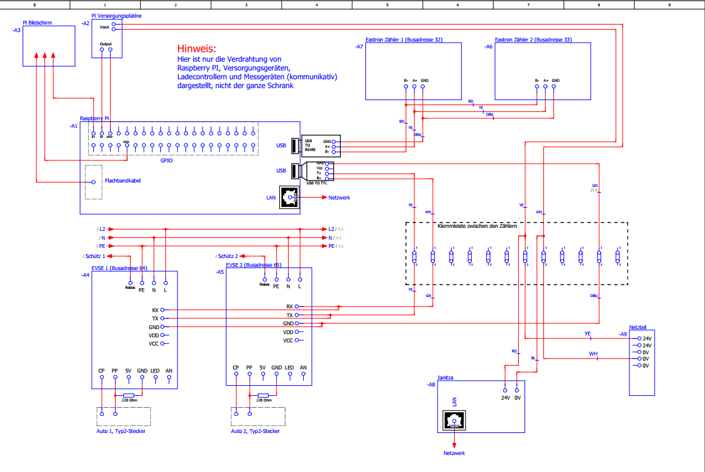
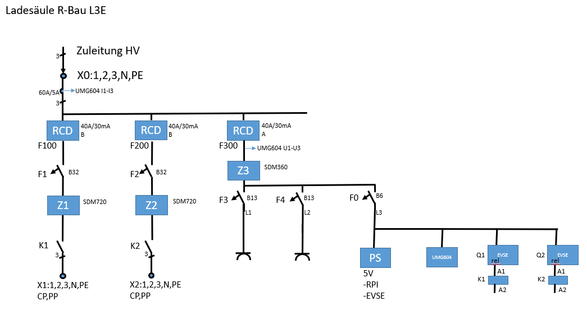
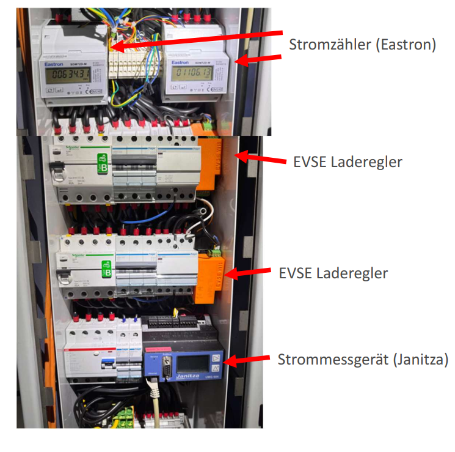
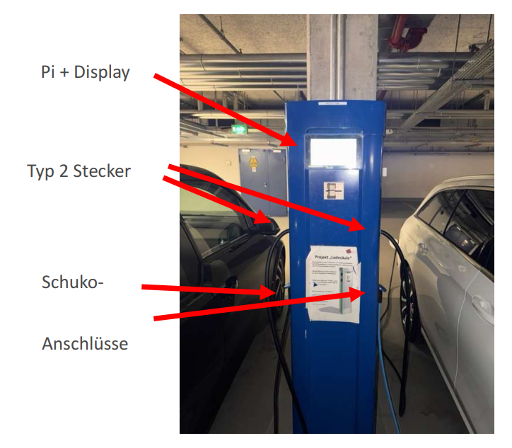

# RETI – Erweiterung einer Ladesäule

Dieses Repository beinhaltet die Ergebnisse der Erweiterung einer Ladesäule an der HM im Rahmen des Projekts **RETI im SoSe 2025**.

## Projektbeschreibung

Im Rahmen des Projekts wurde ein **Kartenleser** an die Ladesäule angebunden, um eine Authentifizierung für angemeldete Benutzer zu ermöglichen. Für den Kartenleser wurde ein eigenes Gehäuse konstruiert und gefertigt.

Für die Authentifizierung wird eine **SQL-Datenbank** verwendet. Die Datenbankabfragen sowie die Steuerung der Ladesäule wurden in **Node-RED** integriert.

Das Herzstück der Ladesäule bildet ein **Raspberry Pi mit Linux-Betriebssystem**, auf dem die gesamte Steuerung über Node-RED erfolgt.

Die Ladesäule verfügt über zwei **EVSE-Laderegler**, wodurch zwei Elektrofahrzeuge gleichzeitig geladen werden können. Zusätzlich befinden sich auf der dritten Phase zwei **Schuko-Steckdosen**.

Zur Erfassung der elektrischen Messwerte werden Messgeräte von **Janitza** und **Eastron** eingesetzt. Dabei werden unter anderem Spannungs-, Strom- und Leistungsdaten erfasst und in der Datenbank protokolliert.

## Dokumentation

Sowohl das **Anwendermanual** als auch die **Entwicklerdokumentation** sind in diesem Repository zu finden.

### Node-RED

Die Programmierung der Ladesäule erfolgte mit **Node-RED**, einem grafischen, flow-basierten Programmiertool.

Der für das Projekt verwendete Node-RED-Flow befindet sich im Ordner `Node-red/`

### 3D-Druck

Im Ordner `3D-Druck/` befinden sich die CAD-Dateien für:

* die Bildschirmhalterung
* die Halterung für den Kartenleser

### Kartenleser

Die Dokumentation zur Konfiguration und Anwendung des Kartenlesers befindet sich im Ordner `Kartenleser_TWN4DevPack492_1/`

Der dort enthaltene Inhalt basiert auf öffentlich zugänglichen Daten des Herstellers **ELATEC**.

### Projektvernissage

Projekte müssen an der HM im Rahmen der **Projektvernissage** vorgestellt werden. Diese beinhaltet einen 60-sekündigen Pitch sowie einen Ausstellungsstand.

Die dazugehörigen Dokumente befinden sich im Ordner:

`Projektvernissage/`

## Bilder

### Verkabelung der Ladesäule

### Einpoliger Schaltplan

### Komponenten der Ladesäule

### Außenansicht der Ladesäule

