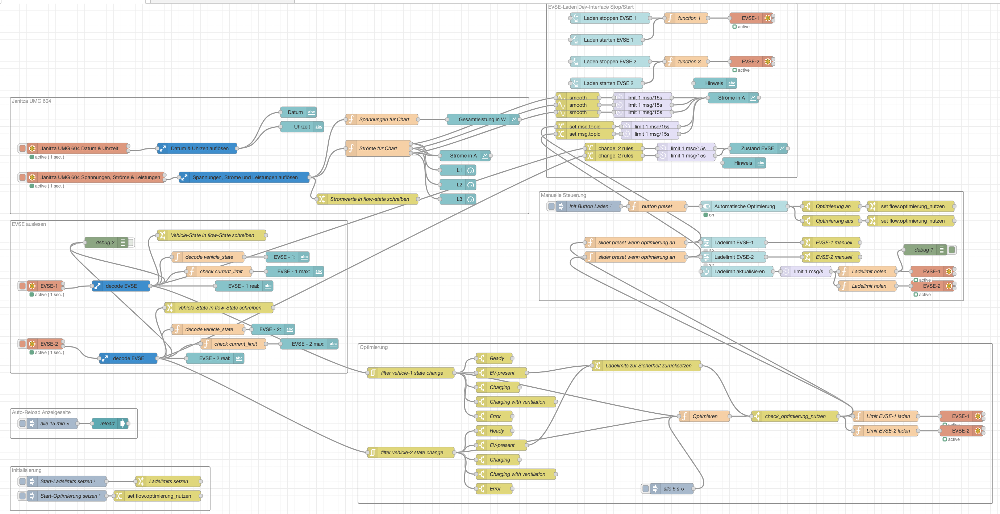
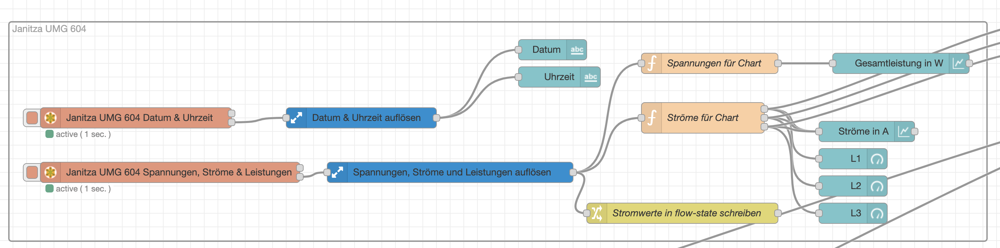
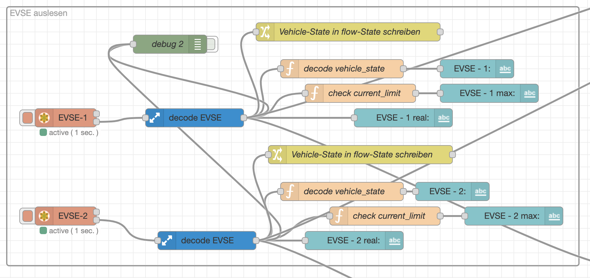
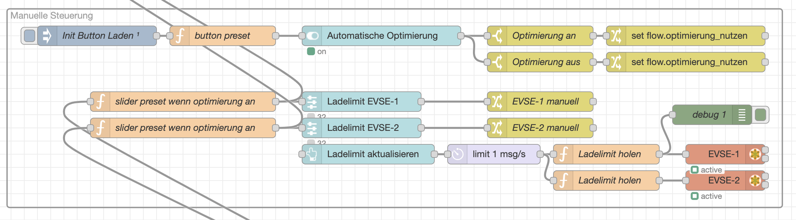
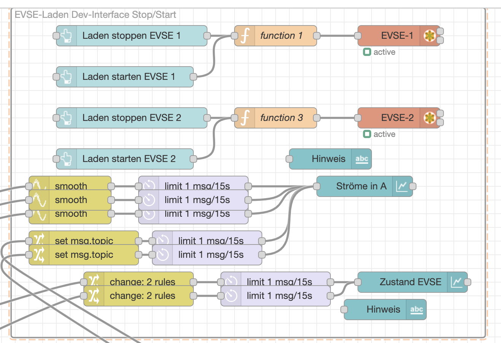
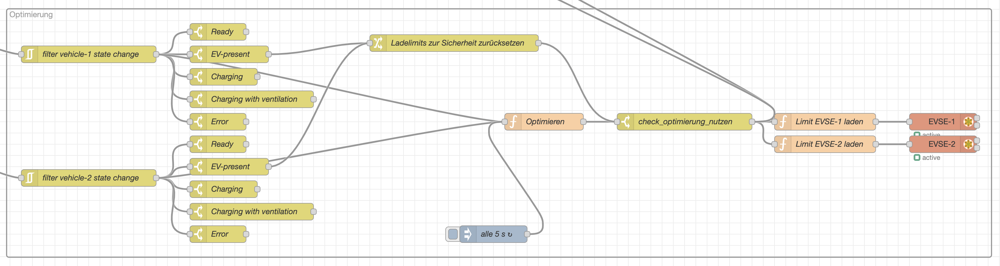

# Entwicklerdoku LaMa
[TOC]

## Verkabelung Ladesäule
Die EVSE-Module kommunizieren per Modbus über RS-422. Die EVSE-Module sind per mitgeliefertem RS-422-USB-Kabel parallel an den Raspberrypi angeschlossen. Dabei ist die Erdverbindung wichtig, die Spannungsversorgung kann aber weggelassen werden (was sie in der Ladesäule auch ist.)

Der in der EVSE verbaute PP-Widerstand hat 220 Ohm, was der EVSE einen Hardware-begrenzeten maximalen Strom von 32A signalisiert.

## Installation Node-Red
Die Installation von Node-Red auf dem Pi erfolgt per Installationsskript von Node-Red selbst: https://nodered.org/docs/getting-started/raspberrypi 
Auf dem Pi wurde davor ein Raspbian Lite installiert, wobei das auch mit der vollen Version ohne Probleme funktionieren sollte.

Die Zusätzlich installierten Node-Red-Erweiterungen sind:
- `node-red-contrib-modbus`
- `node-red-contrib-buffer-parser`
- `node-red-dashboard`

### Environment-File anlegen
Damit die Kommunikation per USB_Serial richtig funktioniert, muss noch die Umgebungsvariable `UV_USE_IO_URING=0` beim Betrieb von Node-Red gesetzt sein.
Am Einfachsten geht das, in dem eine Datei `~./node-red/environment` erstellt wird, in dem `UV_USE_IO_URING=0` steht.

Dieses File wird dann automatisch beim Start von Node-red beachtet und der korrekte Wert von `UV_USE_IO_URING` gesetzt.

## Konfiguration der Bausteine für Modbus
Die Janitza kommuniziert direkt über Modbus-TCP und braucht deswegen keine weitere Konfiguration.

Die EVSE-Module müssen jedoch erst auf den Modbus-Modus gestellt werden und diesen dann auch noch eine Modbus-Adresse gegeben werden.
Das geht am einfachsten persistent über die Software [EVSE-Control](./andere_pdfs/BH3-22-1%20EVSE%20Control.pdf).

Ausschnitt aus der EVSE-Control-Doku:


Sobald das EVSE-Modul im Modbus-Modus ist, kann in das Modbus-Register `2001` die Modbus-Adresse geschrieben werden. **Achtung:** Wenn dort der Wert `0` geschrieben wird, schaltet das EVSE-Modul die Modbus-Kommunikation wieder persistent ab und man muss den ganzen Prozess zum Mdobus-Aktivieren neu durchlaufen.

In der Ladesäule haben die beiden Module die Modbus-Adressen `64` und  `65`.

Die Eastron-Geräte sind aktuell mit der Janitza verbunden, scheinen jedoch nicht korrekt zu kommunizieren, bzw. mir ist es nicht gelungen Daten aus der Säule abzugreifen.


## Logik Node-red


Der gesamte Flow ist als `.json` [hier](./andere_Dateien/flow_prod.json) zu finden.

In Node-red ist der Flow in mehrere Teile aufgeteilt:

### Janitza


In dem Janitza-Flow werden die Daten aus der Janitza ausgelesen, dekodiert und angezeigt.

Die Strom-Werte wird außerdem direkt in den Flow-State geschrieben, um auch ohne eine direkte "Node-Red-Verbindung", insbesondere auch asynchron, auf die Daten zugreifen zu können.

### EVSE auslesen


In dem EVSE-Auslesen-Flow werden die Daten aus beiden EVSE-Modulen ausgelesen, dekodiert und angezeigt. Gleichzeitig löst eine Veränderung des Fahrzeugzustandes hier auch die Optimierung aus.

Der Vehicle-State wird außerdem direkt in den Flow-State geschrieben, um auch ohne eine direkte "Node-Red-Verbindung", insbesondere auch asynchron, auf die Daten zugreifen zu können.

### Manuelle Steuerung


Die Manuelle Steuerung erlaubt es die Optimierung zu deaktivieren und manuell Ladestromwerte zu setzen. Diese schreibt den Boolean `optimierung_nutzen` in den Flow-State, welcher in der Optimierung abgefragt wird, bevor automatische Werte geschrieben werden.

### Admin-Dashboard


Im Admin-Dashboard wird eine längere Historie (~24h) der Stromwerte angezeigt, außerdem gibt es Buttons um betimmte Werte in Modbus-Register der EVSE-Module zu schreiben, um zum Beispiel den Ladevorgang manuell zu stoppen.

### Optimierung


Die Optimierung wird automatisch alle 5 Sekunden ausgelöst, außerdem, falls ein neues Auto an einen Typ-2-Stecker angesteckt wird.
Wird ein neues Auto angesteckt, werden die zugelassenen Ladeströme zur Sicherheit auf 13A zurückgesetzt.

Der Code ist sehr rudimentär und einfach, weil die Stromwerte der einzelnen Typ-2-Lader fehlen.
Im Grunde wird berechnet, wie groß der Aktuelle Offset (bzw. "Spielraum") vom maximal zugelassenen Strom ist und dieser "Offset" dann auf die angeschlossenen Autos aufgeteilt. Wenn der Gesamtstrom größer ist als der maximal zugelassene, wird der Offset negativ und damit der zugelassene Strom für das Auto auch wider geringer.

Dadurch, dass die einzelnen Stromwerte fehlen, kann auch nur sehr rudimentär geprüft werden, dass die Stromwerte nicht den maximal zugelassenen Strom übersteigen werden, das System ist aber durchaus stabil und regelt schnell genug nach, sodass die Sicherung nicht auslöst.

Der Code der Optimierung:
```javascript
// Fallunterscheidung Autos angeschlossen:

let max_gesamtstrom = 32;

let autos_angeschlossen = [false, false];
if (flow.get("vehicle_1_state") > 1 && flow.get("vehicle_1_state") < 5){
    autos_angeschlossen[0] = true;
}

if (flow.get("vehicle_2_state") > 1 && flow.get("vehicle_2_state") < 5){
    autos_angeschlossen[1] = true;
}

let strom_spielraum = max_gesamtstrom - Math.max(flow.get("I_L1"), flow.get("I_L2"), flow.get("I_L3"));
node.warn("Aktueller Spielraum: " + strom_spielraum);
let spielraum_1 = 0;
let spielraum_2 = 0;


// Ladelimits berechnen
// ToDo: Logik für wenn ein Auto nicht den kompletten verfügbaren Strom nutzt?
if(autos_angeschlossen[0] && autos_angeschlossen[1]){
    // Beide Autos angeschlossen -> Spielraum auf beide geben
    spielraum_1 = Math.round(strom_spielraum - Math.round(strom_spielraum/2));
    spielraum_2 = Math.round(strom_spielraum - spielraum_1);

} else if (autos_angeschlossen[0] && !autos_angeschlossen[1]){
    // Nur Auto 1 angeschlossen -> Spielraum komplett an Auto 1
    spielraum_1 = Math.round(strom_spielraum);
    flow.set("evse_2_optimized", 0);

} else if (!autos_angeschlossen[0] && autos_angeschlossen[1]){
    // Nur Auto 2 angeschlossen -> Spielraum komplett an Auto 2
    spielraum_2 = Math.round(strom_spielraum);
    flow.set("evse_1_optimized", 0);

} else {
    // Kein TYP-2-Fahrzeug angeschlossen, Regelung nicht möglich

}

node.warn("Neue Spielräume (vor Schutz): " + spielraum_1 + ", " + spielraum_2);


// Schutz: Prüfen ob theoretisch freigegebener Strom das System überlasten würde
// Nicht wirklich prüfbar, da die real gerade genommene Last nicht gemessen werden kann
// und auch nicht von der EVSE gemeldet wird.

while( -flow.get("vehicle_1_actual_amps") + spielraum_1 - flow.get("vehicle_2_actual_amps") + spielraum_2 + Math.max(flow.get("I_L1"), flow.get("I_L2"), flow.get("I_L3")) > max_gesamtstrom){
  // Berechneter Strom zu hoch, spielraum reduzieren
  // node.warn("Strom zu hoch, Berechnung wird angepasst");
    if(flow.get("evse_1_optimized") + spielraum_1 > 0){
        spielraum_1 -= 1;
    }
    if(flow.get("evse_2_optimized") + spielraum_2 > 0){
        spielraum_2 -= 1;
    }

}


node.warn("Neue Spielräume (nach Schutz): " + spielraum_1 + ", " + spielraum_2);

// hard limits
if(flow.get("evse_1_optimized") + spielraum_1 > 32){
    flow.set("evse_1_optimized", 32); 
} else {
    flow.set("evse_1_optimized", flow.get("evse_1_optimized") + spielraum_1);
}

if(flow.get("evse_2_optimized") + spielraum_2 > 32){
    flow.set("evse_2_optimized", 32); 
} else {
    flow.set("evse_2_optimized", flow.get("evse_2_optimized") + spielraum_2);
}


return msg;
```

## Login-Daten und Zugriff
Der Zugriff auf den Raspberrypi ist nur im VPN möglich. Einen VPN-Zugang bekommt man bei [Herrn Kerber](mailto:georg.kerber@hm.edu).
Der Login auf dem Pi ist nur über einen SSH-Key möglich, falls da ein neues installiert werden soll, bitte an [Lukas Schulz](mailto:l.schulz@hm.edu) wenden.

Das Node-Red-Admin-Interface ist im VPN unter [http://10.21.6.6:1880(http://10.21.6.6:1880)] erreichbar. 

Der Login dafür ist:

Username: `admin`

Password: `lamaadmin1234`


## "Admin-Interface"
Das "Admin-Interface" für Enduser ist unter [http://10.21.6.6:1880/ui/#!/1](http://10.21.6.6:1880/ui/#!/1) erreichbar.

## InfluxDB
InfluxDB ist eine sog. Time-Series-Database und wird in dem Projekt genutzt um die Messdaten besser zu aggregieren und später aufbereiten zu können, als es Node-Red selbst ermöglicht.
InfluxDBv2 ist über das InfluxDB-Repository installiert.
Eine Anleitung dafür gibt es direkt auf der [InfluxDB-Website](https://docs.influxdata.com/influxdb/v2/install/#install-influxdb-as-a-service-with-systemd).

Die Zugangsdaten lauten:

Username: `admin`

Password: `l4m4admin1234`

Der Access-Token für den Bucket `lama` lautet: `_YqV6vXYiGUQxo8nLF0x4dVXY8nnl-dguSgeu90oZzs3ob3Fv-9HkWQzUEXwBd6HjQvS-PLWcHpv79EWpNCL0g==`

Das Admin-Interface für InfluxDB ist unter [http://10.21.6.6:8086](https://10.21.6.6:8086) erreichbar.

Die Retention (also wie lange die Daten bewahrt werden) ist auf 2 Jahre gesetzt, damit die SD-Karte nicht irgendwann volläuft, da ja doch sekündlich Werte geschrieben werden.


## Grafana
Grafana ist ein Tool um Daten aus insbesondere auch Time-Series-Databases aufzubereiten und visuell darzustellen. Über Grafana werden die aktuellen Ladesäulenwerte auf dem Raspi-Display angezeigt.
Grafana ist über das Garafana-Repository installiert.
Eine Anleitung dafür gibt es direkt auf der [Grafana-Website](https://grafana.com/tutorials/install-grafana-on-raspberry-pi/).

Die Zugangsdaten lauten:

Username: `admin`

Password: `lamaadmin1234!`

Das Interface für Grafana ist unter [https://10.21.6.6:3000](https://10.21.6.6:3000) erreichbar.

Damit der Zugriff auf das Webinterface auch ohne login möglich ist (was für die Anzeige auf dem Bildschirm notwendig ist), muss in der Config-Datei vom Grafana-Server unter `/etc/grafana/grafana.ini` beim Punkt `[auth.anonymous]` der Unterpunkt `enabled` auskommentiert werden (das `;` am Anfang der Zeile löschen) und auf `true` gesetzt werden.

Die Verbindung mit InfluxDB wird in Grafana unter `http://10.21.6.6:3000/connections/datasources/influxdb` eingerichtet, da müssen nur noch die Zugangsdaten von der lokalen InfluxDB-Installation eingetragen werden.

Die Dashboard-Config für die Anzeige auf dem Pi liegt [hier](./andere_Dateien/Ladesäule%20Tiefgarage%20Messdaten%20und%20Optimierung%20Anzeige%20Pi.json).

Die Dashboard-Config für eigene Analyse und Betrachtung liegt [hier](./andere_Dateien/Ladesäule%20Tiefgarage%20Messdaten%20und%20Optimierung.json).

## Autostart Bildschirm-Anzeige
Der Autostart der Anzeige auf dem Bildschirm läuft über ein Linux-Autostart-Skript in `~/.config/autostart/chrome.desktop`
```bash
[Desktop Entry]
Type=Application
Exec=bash -c '/usr/bin/sleep 120 && /usr/bin/chromium-browser --app="http://10.21.6.6:3000/d/feakyxqu71o8wd/1684608?orgId=1&from=now-6h&to=now&timezone=browser&refresh=5s&kiosk" --noerrdialogs --disable-session-crashed-bubble --disable-infobars --check-for-update-interval=604800 --disable-pinch --force-device-scale-factor=1 --enable-auto-reload --enable-auto-reload --kiosk'
```
Der Start ist um 2min verzögert, damit Grafana ausreichend Zeit hat zum Starten und man nicht warten muss, bis Chromium die Fehlerseite automatisch neu lädt.

### Autologin beim Boot
Damit der Autologin und die Anzeige des Desktops funktioniert, muss das noch in den Systemeinstellungen angepasst werden.
Dafür muss per Terminal der Befehl `sudo raspi-config` ausgeführt werden.

Dann per Pfeiltasten `[up]`, `[down]` und `[enter]` navigieren:

`1 System Options -> S5 Boot / Auto Login -> B4 Desktop Autologin`
Die Auswahl mit einem Enter bestätigen, dann auf der Startseite per `[Tab]` zu `Finish` navigieren, mit `[enter]` bestätigen und ggf. neustarten.

